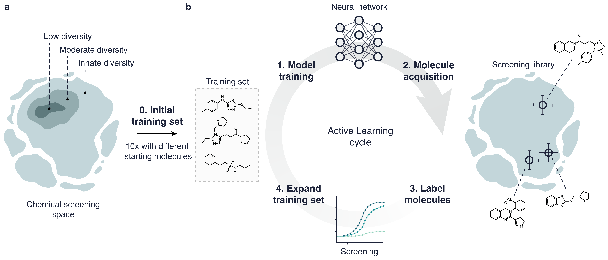

<h1 id="benchmark-study">Traversing Chemical Space with Active Deep Learning</h1>
Derek van Tilborg and Francesca Grisoni*

*f.grisoni@tue.nl

<h2 id="benchmark-study">Abstract</h2>

Deep learning is accelerating drug discovery. However, current approaches are often affected by limitations in the
available data, e.g., in terms of size or molecular diversity. Active learning is poised to be a solution for drug discovery
in low-data regimes. In active learning, a model is updated iteratively by taking multiple smaller screening steps, instead
of suggesting many molecules at once with a single model for traditional ‘one-shot’ screening. This iterative approach
aims to improve models during the screening process and can adjust course along the way. Despite pioneering
applications, it is currently unclear how active learning holds up to traditional approaches and what the best strategies
are for prospective drug discovery applications. In this study, we combine six active learning strategies with two distinct
deep learning methods and analyse their performance on three large-scale libraries. For each strategy, we investigate its
capacity to discover bioactive hits and explore the chemical space. We found that active learning can achieve up to a
six-fold improvement in hit retrieval compared to traditional methods in a low-data scenario. The strategy to acquire
new molecules at each cycle resulted to be the primary driver of performance, and it determined the ‘molecular journey’
throughout screening cycles. Finally, we show that active learning can quickly compensate for a lack of molecular
diversity in the starting set. These results advocate for the adoption of active deep learning to accelerate drug discovery
in low-data regimes.

<!-- How to cite-->
<h2 id="How-to-cite">How to cite</h2>
You can currently cite our preprint

Traversing Chemical Space with Active Deep Learning. Derek van Tilborg and Francesca Grisoni.
ChemRxiv, 2023.
DOI: https://doi.org/10.26434/chemrxiv-2023-wgl32

<!-- License-->
<h2 id="License">License</h2>

All code is under MIT license.
