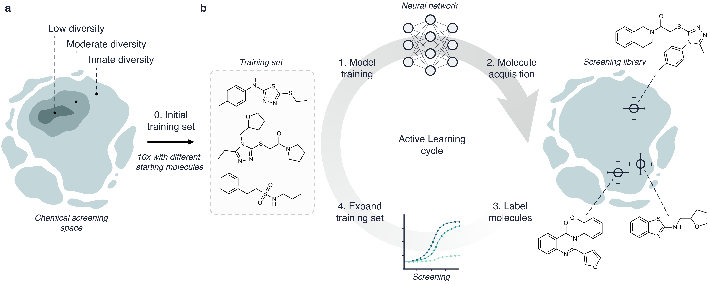

[](https://chemrxiv.org/engage/chemrxiv/article-details/65d8833ce9ebbb4db9098cb5)
[](https://10.0.20.161/zenodo.10781477)


<h1 id="benchmark-study">Traversing Chemical Space with Active Deep Learning: A Computational Framework for Low-data Drug Discovery</h1>

 
## Description
This repository contains all code used in our study.

- [Abstract](#abstract)
- [Modules](#modules)
- [Requirements](#requirements)
- [Installation](#installation)
- [Usage](#usage)
- [How to cite](#cite)
- [License](#license)


<h2 id="abstract">Abstract</h2>

Deep learning is accelerating drug discovery. However, current approaches are often affected by limitations in the available data, e.g., in terms of size or molecular diversity. Active deep learning has
an untapped potential for low-data drug discovery, as it allows to improve a model iteratively during the screening process by acquiring new data, and to adjust its course along the way. However, several known unknowns exist when it comes to active learning: (a) what the best computational strategies are for chemical space exploration, (b) how active learning holds up to traditional, non-iterative, approaches, and (c) how it should be used in the low-data scenarios typical of drug discovery. These open questions currently limit the wider adoption of active learning in drug discovery. To provide answers, this study simulates a real-world low-data drug discovery scenario, and systematically analyses six active learning strategies combined with two deep learning architectures, on three large- scale molecular libraries. Not only do we show that active learning can achieve up to a six-fold improvement in hit discovery compared to traditional methods, but we also identify the most important determinants of its success in low-data regimes. This study lays the first-in-time foundations for the prospective use of active deep learning for low-data drug discovery and is expected to accelerate its adoption.



<h2 id="modules">Modules</h2>
- **data_prep.py**: Processes data and clusters compounds for sampling diversity.
- **nn.py**: Contains neural network models (MLP, GCN, etc.).
- **screening.py**: Core script for active learning cycles.
- **utils.py**: Utility functions for data handling and evaluation.
- **main.py**: Entry point for running experiments with customizable parameters.

<h2 id="requirements">Requirements</h2>

This codebase uses Python 3.9 and primarily depends on:
- [PyTorch](https://pytorch.org/) (2.0.1)
- [PyTorch Geometric](https://pytorch-geometric.readthedocs.io/en/latest/) (2.3.1)
- [RDKit](https://www.rdkit.org/) (2023.3.2)
- [Scikit-learn](https://scikit-learn.org/) (1.3.0)

Tested on Ubuntu 22.04.3 and macOS 13.3.1

<h2 id="Installation">Installation</h2>
Install dependencies from the provided env.yaml file. This typically takes a couple of minutes (tested on Ubuntu 22.04.3).

```conda env create -f env.yaml```

Manual installation of requirements (tested on Ubuntu 22.04.3 and macOS 13.3.1):

```angular2html

conda create -n traversing_chem python=3.9
conda activate traversing_chem
conda install pytorch==1.12.1 torchvision==0.13.1 torchaudio==0.12.1 cudatoolkit=11.3 -c pytorch
conda install pyg -c pyg
pip3 install scikit-learn==1.3.0 rdkit==2023.3.2 pandas tqdm argparse h5py

```

<h2 id="usage">Usage</h2>

### Data 

Before running the active learning pipeline on the same data used in the paper, the original data from LITPCBA (https://drugdesign.unistra.fr/LIT-PCBA/) needs to be processed.

1. run `python active_learning/preprocess_data.py` to process and cluster all data. This takes around an hour on a regular computer. Clustering requires >128GB of RAM.

Alternatively, pre-processed data (~40GB) can be found here: https://10.0.20.161/zenodo.10781477

### Running the pipeline
2. Run `python main.py` with desired command-line arguments to start the active learning process. Ensure necessary data files are present.

### Demo
1. Run `python experiments/preprocess_demo.py`
2. Run `python experiments/demo.py -o demo_results.csv -acq bald -arch mlp -dataset DEMO ` 

After several minutes, this should produce a csv with mock screening results.

### Replicate results
Change the paths in `experiments/replicate_all_results.sh` and run it. Running all experiments will take several thousand hours using an NVIDIA A100 GPU (40GB), but this script is easily modified to run in parallel.


<h2 id="cite">How to cite</h2>
You can currently cite our preprint

Traversing Chemical Space with Active Deep Learning: A Computational Framework for Low-data Drug Discovery. Derek van Tilborg and Francesca Grisoni.
ChemRxiv, 2023.
DOI: https://doi.org/10.26434/chemrxiv-2023-wgl32-v3


<h2 id="license">License</h2>

All code is under MIT license.
